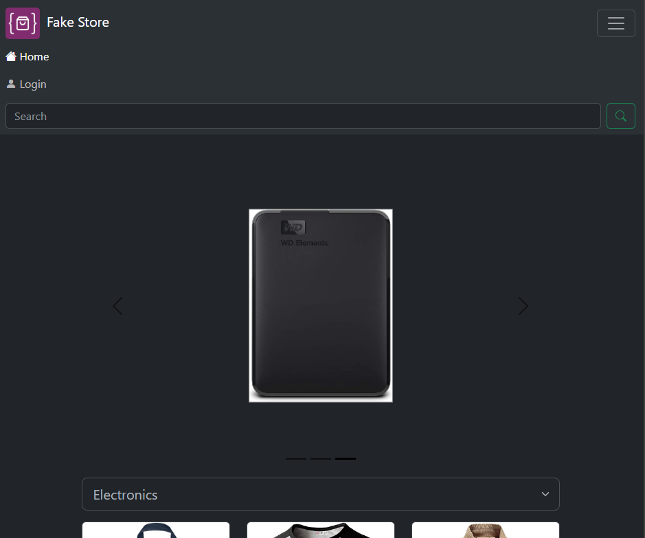
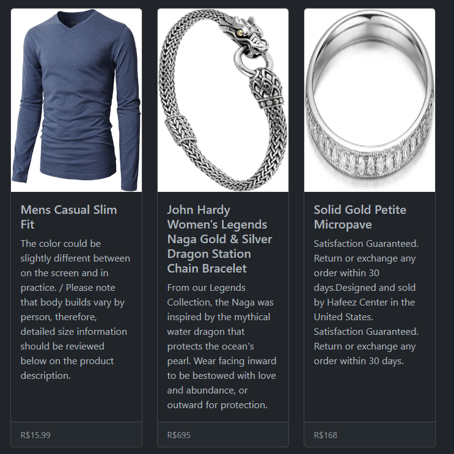
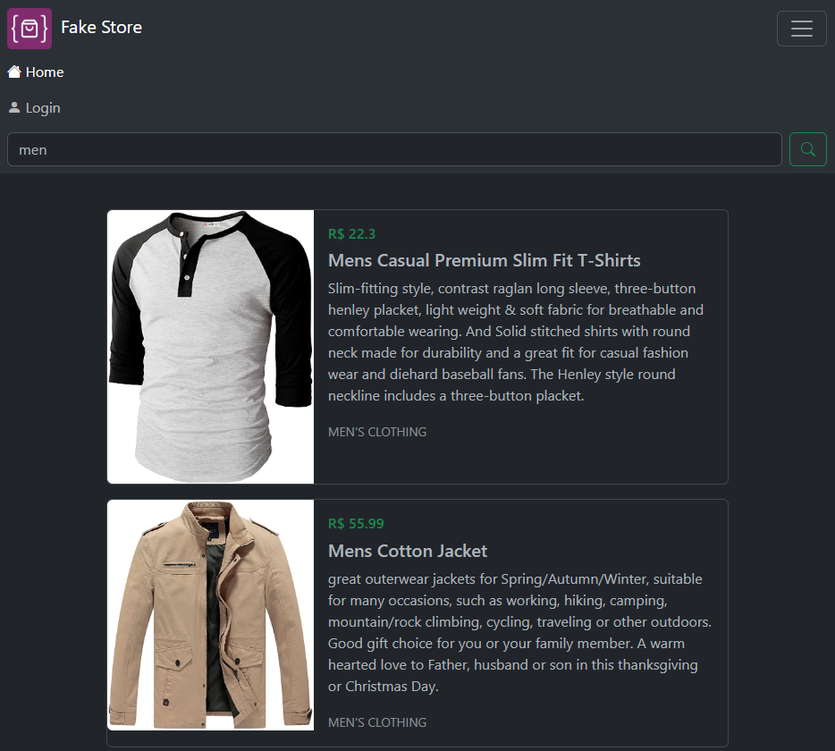
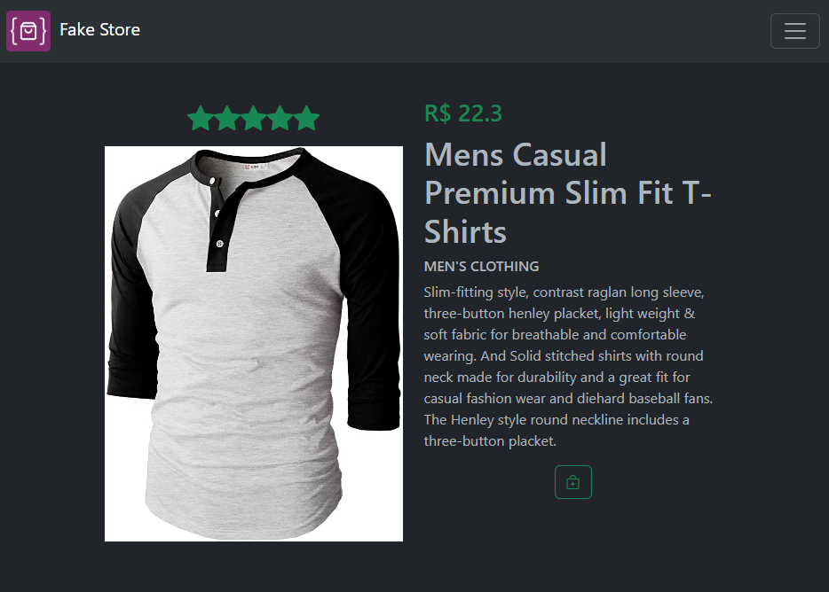
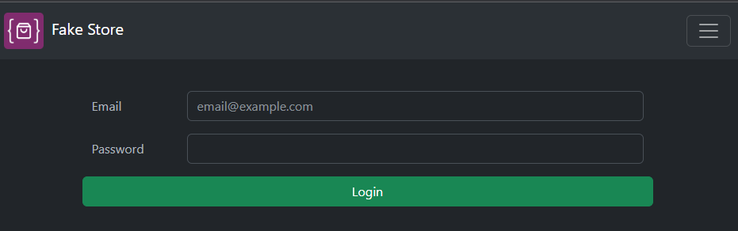

# Fake Store

## Table of Contents

- [Introduction](#introduction)
- [How to Use](#how-to-use)
- [API Endpoints](#api-endpoints)
- [Used Technologies](#used-technologies)
- [Additional Resources](#additional-resources)
- [Roadmap](#roadmap)

## Introduction

This project is a small e-commerce website that utilizes the "Fake Store API" to fetch product data. The site is developed using HTML, CSS, and JavaScript, with the Bootstrap framework. It features the following functionalities:

- Carousel with category filtering
- Cards section displaying all products
- Search bar
- Product detail page for each clicked item
- Login area (beta phase) for users registered via API

## Responsive Design

The website is fully responsive, ensuring a seamless experience across various devices. It adapts to different screen sizes, including mobile, tablet, and desktop devices.

## How to Use

1. On the homepage, you will see a carousel displaying the most recent products. You can filter the products by category by clicking the category buttons.

2. In the cards section, you will find all available products. Click on a card to view the product's detail page.

3. Utilize the search bar to find specific products by name or description.

4. On the product's detail page, you will find more detailed information and the option to add the product to the cart.

## API Endpoints

- `/products`: Returns all available products.
- `/products/{id}`: Returns a specific product based on the ID.
- `/products/category/{category}`: Returns products based on the specified category.
- `/users`: Returns information about the users registered in the system.

## Used Technologies

- HTML
- CSS
- JavaScript
- Bootstrap

## Additional Resources

- [Fake Store API Documentation](https://fakestoreapi.com/docs)
- [Bootstrap Tutorial](https://getbootstrap.com/docs/)

## Roadmap

- Implement shopping cart functionality.
- Add user authentication.
- Improve CSS design.